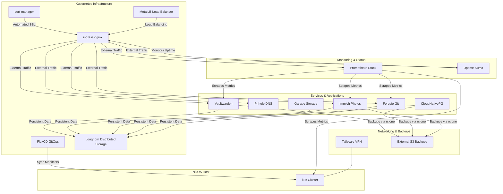

# Homelab Configuration

This directory contains the configuration for the homelab, which is built on top of a Kubernetes cluster managed by k3s. The entire setup is declarative, using Nix to define and configure all the services.

Service enablement and host-specific values are now centralized in `hosts/<host>/config/homelab-config/`. This separation keeps the modules generic and reusable across different host environments.

## Architecture

The following diagram illustrates the high-level architecture of the homelab:

## Structure

The homelab is composed of several modules, each responsible for a specific part of the infrastructure:

-   **`k3s/`**: The core Kubernetes setup.
-   **`flux/`**: Manages the GitOps workflow, keeping the cluster state in sync with the configuration.
-   **`security/`**: Handles secrets management for homelab services using `sops-nix`.
-   **`services/`**: Defines the various services running in the homelab.
-   **`rclone/`**: Configures `rclone` for backups and syncing.
-   **`ingress-nginx/`**: Manages ingress traffic to services.
-   **`vaultwarden/`**: A self-hosted password manager.
-   **`cert-manager/`**: Automates TLS certificate management.
-   **`garage/`**: A self-hosted distributed object storage.
-   **`forgejo/`**: A self-hosted Git service.
-   **`databases/`**: Manages databases used by services (e.g., CloudNativePG).
-   **`metallb/`**: Provides load-balancing for services.
-   **`pihole/`**: A network-wide ad-blocker.
-   **`prometheus-stack/`**: Unified monitoring and alerting stack (Prometheus & Grafana). Replaces standalone modules.
-   **`prometheus/`**: Legacy standalone Prometheus module (deprecated).
-   **`grafana/`**: Legacy standalone Grafana module (deprecated).
-   **`uptime-kuma/`**: Self-hosted monitoring tool.
-   **`longhorn/`**: A distributed block storage system.
-   **`tailscale/`**: A zero-config VPN integration.
-   **`immich/`**: A self-hosted photo and video management solution.

The main entry point is `default.nix`, which imports all the modules. The host-specific configuration determines which of these are enabled and how they are configured.
