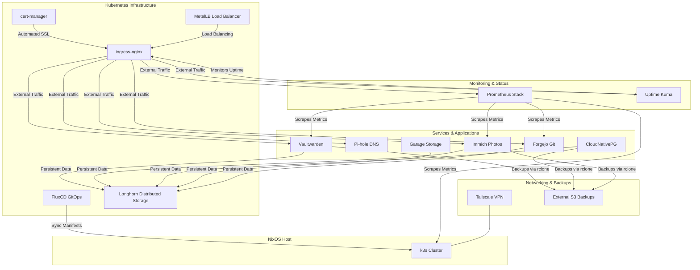

# Homelab Configuration

This directory contains the configuration for the homelab, which is built on top of a Kubernetes cluster managed by k3s. The entire setup is declarative, using Nix to define and configure all the services.

The entire homelab stack is controlled by a global `homelab.enable` toggle. Service enablement and host-specific values are centralized in `hosts/<host>/config/homelab-config/`. This separation keeps the modules generic and reusable across different host environments.

> [!NOTE]
> `homelab.enable` is currently `false` on all four hosts, so none of the services below are deployed by a
> default rebuild. The per-service options remain populated in each host's `homelab-config`, so flipping the
> global toggle brings the stack back up with its previous settings.

## Architecture

The following diagram illustrates the high-level architecture of the homelab:

## Structure

The homelab is composed of several modules, each responsible for a specific part of the infrastructure:

- **`k3s/`**: The core Kubernetes setup.
- **`services/`**: An extended `services.k3s` module adding declarative `manifests`, `charts` and
  `autoDeployCharts` options, which the other modules use to ship their resources into the cluster.
- **`flux/`**: Manages the GitOps workflow, keeping the cluster state in sync with an S3 bucket, with
  Discord notifications.
- **`security/`**: Handles secrets management for homelab services using `sops-nix`.
- **`rclone/`**: Configures `rclone` for backups and syncing.
- **`ingress-nginx/`**: Manages ingress traffic to services.
- **`vaultwarden/`**: A self-hosted password manager.
- **`cert-manager/`**: Automates TLS certificate management (CRDs, namespace, service and cluster issuer).
- **`garage/`**: A self-hosted distributed object storage (options only — not yet deployed).
- **`forgejo/`**: A self-hosted Git service.
- **`databases/`**: Manages databases used by services (CloudNativePG).
- **`metallb/`**: Provides load-balancing for services, with an `IPAddressPool` and `L2Advertisement`.
- **`pihole/`**: A network-wide ad-blocker, including external-dns RBAC.
- **`prometheus-stack/`**: Unified monitoring and alerting stack (`kube-prometheus-stack`). This is the
  module that is actually enabled.
- **`prometheus/`**: Legacy standalone Prometheus module (deprecated, disabled).
- **`grafana/`**: Legacy standalone Grafana module (deprecated, disabled).
- **`uptime-kuma/`**: Self-hosted monitoring tool.
- **`longhorn/`**: A distributed block storage system. Currently disabled — it interferes with flannel
  generation, see [k3s-io/k3s#13277](https://github.com/k3s-io/k3s/issues/13277#issuecomment-3837472085).
- **`tailscale/`**: A zero-config VPN integration.
- **`immich/`**: A self-hosted photo and video management solution, with its own PVC and database.

Most service modules follow the same shape: a `default.nix` holding the Helm release or manifests, plus
`namespace/` and `certificate/` subdirectories for the Kubernetes namespace and its self-signed TLS
certificate.

The main entry point is `default.nix`, which imports all the modules and wires in the `downloadHelmChart`
overlay from `modules/utils/`. The host-specific configuration determines which of these are enabled and how
they are configured.

## Secrets

Homelab secrets are stored next to the modules rather than under a host, and are decrypted by
`security/sops.nix`:

- `secrets.yaml` — Flux S3 credentials, the Discord webhook, and the Pi-hole password.
- `pihole-secrets.yaml`, `cert-secrets.yaml`, `tailscale-secrets.yaml` — per-service secrets.

They can be rotated interactively with `resetSopsSecrets` (see
[modules/nixos/README.md](../nixos/README.md#resetsopssecrets)).

## Static addresses

Services that need a stable address take one from the MetalLB pool (`192.168.1.201-192.168.1.254`) as
configured in each host's `homelab-config`, for example Vaultwarden on `.201`, Pi-hole on `.204`, Uptime
Kuma on `.209`, Grafana on `.210` and Forgejo on `.212`/`.213`.
